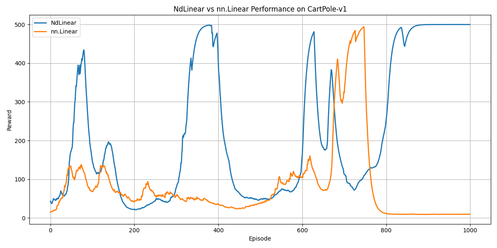
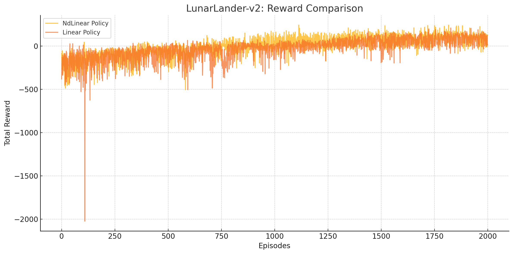

# NdLinear Benchmarking in Reinforcement Learning

## 📌 Overview
This project benchmarks [NdLinear](https://github.com/ensemble-core/NdLinear), a multi-space representation layer, against standard `nn.Linear` in reinforcement learning environments using policy gradient methods.

We test performance in two environments:

- 🎯 **CartPole-v1**
- 🚀 **LunarLander-v2**

---

## 🚀 Objective
Evaluate whether `NdLinear` improves learning efficiency, reward stability, and final performance in reinforcement learning tasks compared to standard linear layers.

---

## 🧠 Methodology

- **Environments**: CartPole-v1, LunarLander-v2 (OpenAI Gym)
- **Model Types**:
  - `NdLinearPolicy`: Uses NdLinear layers
  - `LinearPolicy`: Uses PyTorch nn.Linear
- **Algorithm**: REINFORCE (policy gradient)
- **Training Length**:
  - CartPole: 1000 episodes
  - LunarLander: 2000 episodes
- **Metrics**: Total reward per episode

---

## 🏗️ Architecture

| Model          | Structure                                           |
|----------------|-----------------------------------------------------|
| NdLinearPolicy | NdLinear(Obs -> Hidden) → ReLU → NdLinear → Softmax |
| LinearPolicy   | nn.Linear(Obs -> Hidden) → ReLU → nn.Linear → Softmax |

---

## 📈 Results

### 🟢 CartPole-v1

- NdLinear converged faster and reached the 500 reward ceiling more consistently.
- LinearPolicy was less stable and occasionally regressed.



---

### 🔵 LunarLander-v2

- NdLinear shows significant learning progress after 1000 episodes.
- LinearPolicy struggled with negative rewards and did not learn a stable policy.



---

## 📦 Project Structure

```
NdLinear/
├── cartpole/
│   ├── train.py
│   ├── train_linear.py
│   ├── plot_comparison.py
│   ├── rewards_log.json
│   ├── rewards_log_linear.json
│   └── Figure_1.png
├── lunarlander/
│   ├── train.py
│   ├── train_linear.py
│   ├── plot_comparison.py
│   ├── rewards_log.json
│   ├── rewards_log_linear.json
│   └── Figure_2.png
├── models/
│   ├── ndlinear_policy.py
│   ├── linear_policy.py
│   └── local_ndlinear.py
└── README.md
```

---

## 🧪 How to Run

### Train NdLinear
```bash
python cartpole/train.py
python lunarlander/train.py
```

### Train nn.Linear baseline
```bash
python cartpole/train_linear.py
python lunarlander/train_linear.py
```

### Plot reward comparisons
```bash
python cartpole/plot_comparison.py
python lunarlander/plot_comparison.py
```

---

## 👤 Author
**Aryan Patodiya**  
M.S. Computer Science @ CSU Fresno  
[GitHub Profile](https://github.com/aryanpatodiya)

---

## ✅ Submission Checklist

- [x] Starred the NdLinear GitHub repo
- [x] Benchmarked on two environments
- [x] Compared NdLinear vs nn.Linear performance
- [x] Public repo with logs, plots, and README
